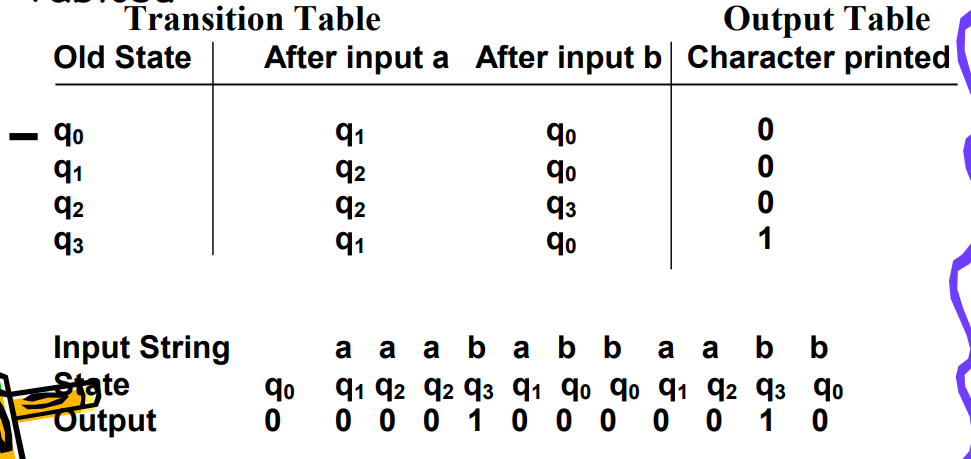
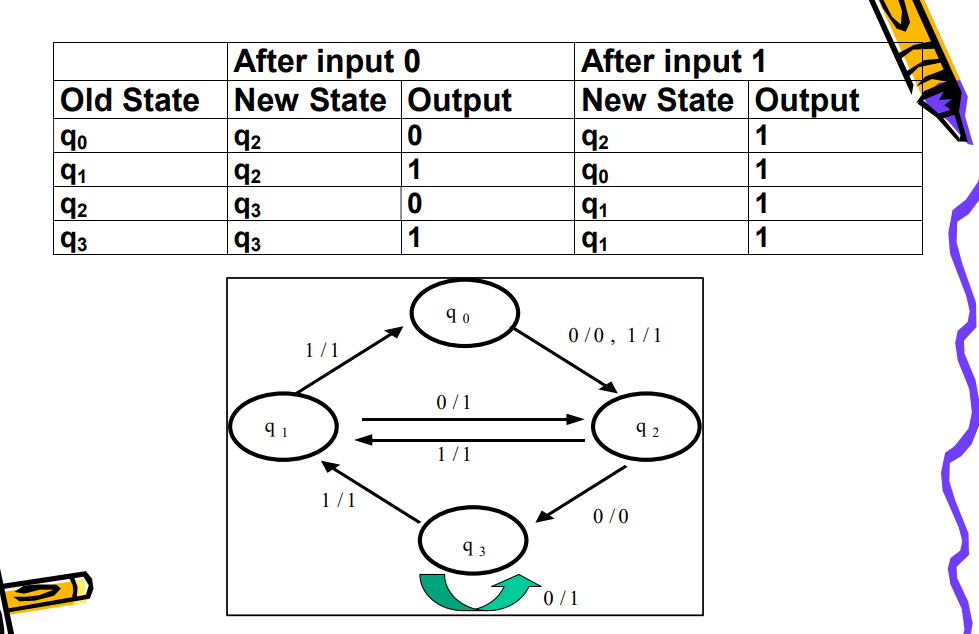

# Implementation of Moore and Mealy machines
## I wrote a simple implementation of Moore and Mealy machines in C language for the assignment given in the Automata class.
- According to the table given in the .txt files, I made the states go where they should go with different inputs.
- I used the following table examples in .txt files.
- .txt files do not have column headings, they are written in order.
## In Turkish
# Moore ve Mealy makinelerinin uygulanması
##Automata dersinde verilen ödev için Moore ve Mealy makinelerinin C dilinde basit bir implementasyonunu yazdım.
- .txt dosyalarında verilen tabloya göre farklı girdilerle durumların gitmesi gereken yere gitmesini sağladım.
- Aşağıdaki tablo örneklerini .txt dosyalarında kullandım.
- .txt dosyaları sütun başlıkları içermez, sırayla yazılır.

## Moore Machine Table Example
 

## Mealy Machine Table Example
 
